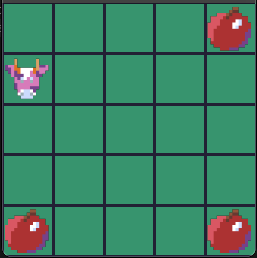

# Sustainable Foraging Problem Grid Environment
This environment for my final year BSc Computer Science project investigating the use of Curious Reinforcement Learning Agents in the Sustainable Foraging Problem.

# Features

- Includes an implementation of a deep q-network (DQN) with experience replay and DQN with curiosity learning module
- Detailed plotting and logging
- Multiple run training aggregator

## Installation

### Prerequisites
- Python 3.8 or higher
- Conda package manager
https://github.com/AlexGulliver/Sustainable-Foraging-Environment.git
1. Install Conda
2. Run command: conda env create -f environment.yml

# Usage

Run a single training session in train.py

Run multiple and aggregate results in trainmultiple.py

Extend /lb-foraging/lb-foraging/agents/foragingagent.py with your own algorithm

## Background

### The Sustainable Foraging Problem

The Sustainable Foraging problem is a multi-agent optimisation problem that explores whether agents can learn to forage in a way that ensures their survival alongside the sustainability of their environment.

For information on the Sustainable Foraging problem see:
https://ieeexplore.ieee.org/document/10336227

### What is Curiosity?

Curiosity in Reinforcement Learning is a method to supplement agents with intrinsically sourced reward feedback to boost their learning, particularly in sparse-reward environments. 

The reward signal provided by a curiosity module is informed by a prediction error of the next state.

For insight into curiosity learning see:
https://arxiv.org/abs/1705.05363

### Level-Based Foraging

This environment is based on the Level-Based Foraging environment.

https://github.com/semitable/lb-foraging
